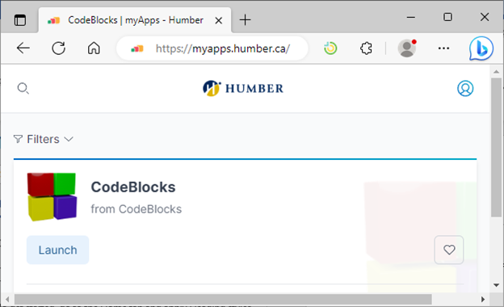
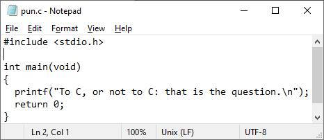
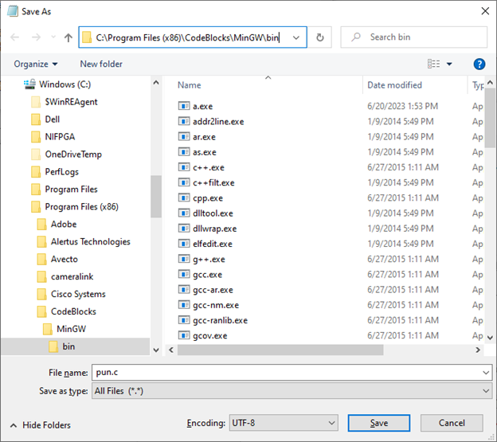
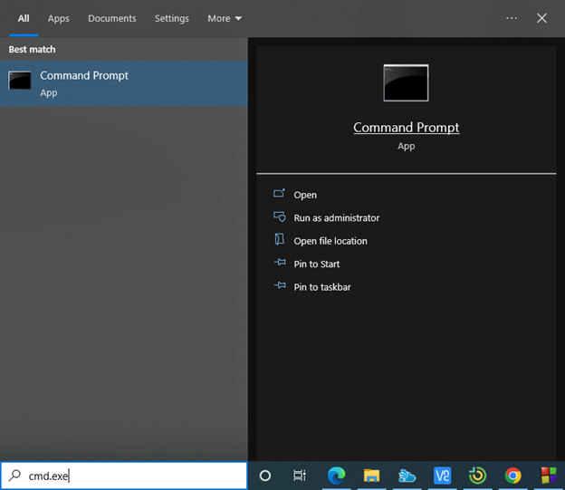
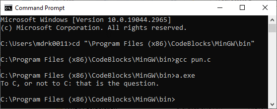

## 1. Running your first Code::Blocks program

Start up and log in to a computer.

Go to `myapps.humber.ca/labs` and Launch `Code::Blocks`

Use notepad to create a file containing:

Save it as `C:\Program Files (x86)\CodeBlocks\MinGW\bin\pun.c`

Open a command prompt

Compile and run the code:

