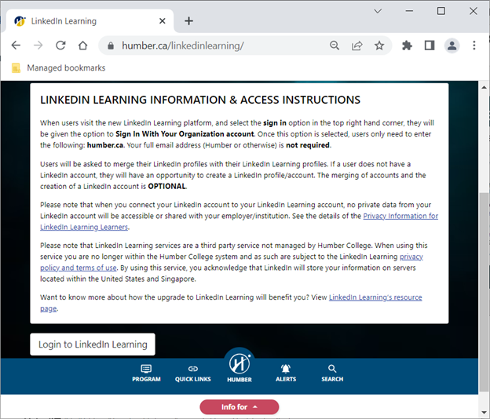
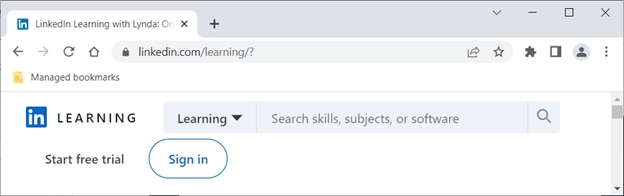
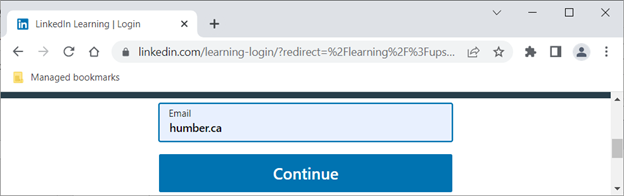
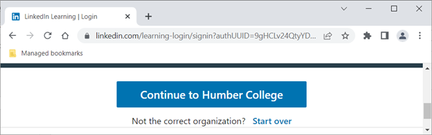

# curses
1.  Visit https://humber.ca/linkedinlearning/
2.	Click on Login to LinkedIn Learning   

3.	Click on Sign in   

4.	Enter humber.ca as your email and click Continue   

5.	Click Continue to Humber College   

6.	Login with your Single Sign On credentials.
7.  For suplementarty learning visit https://www.linkedin.com/learning/learning-c-5/
8.  For curses visit https://www.linkedin.com/learning/exploring-c-libraries/building-an-ncurses-program
9.  For the white/green pis download and install https://archive.raspbian.org/raspbian/pool/main/n/ncurses/libncurses-dev_6.4-4_armhf.deb
```c
#include <curses.h>
//or #include <ncurses.h>
//compile by typing gcc testingcurses.c -lcurses 
//or by typing gcc testingcurses.c -lncurses 
int main()
{	
	initscr();			/* Start curses mode 		  */
	mvprintw(1,1,"Hello World !!!");/* Print Hello World		  */
	refresh();			/* Print it on to the real screen */
	getch();			/* Wait for user input */
	endwin();			/* End curses mode		  */

	return 0;
}

```
## Note regarding includes
1. <stdio.h> is needed for printf(), scanf()
2. <stdlib.h> is needed for EXIT_SUCCESS, EXIT_FAILURE
3. <unistd.h> is needed for usleep()
4. <time.h> is needed for
   ```c
   clock_t now;  // time_t now;
   now = clock(); // now=time(NULL);
   printf("%s\n", ctime(&now));
   ```
