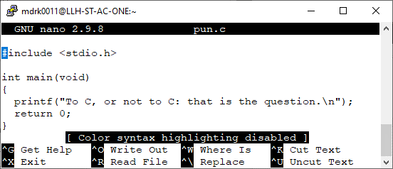

# TECH 104 Lab 01

1.  Demonstrate the execution of the program to your professor. ___/2.5

2.  Choose a system that has a computer program that you are familiar or will
    become familiar with by being the first to choose it on the Blackboard
    Discussion forum. ___/1.5

## 1. Running your first program

Start up and log in to a computer.

Go to `myapps.humber.ca/labs` and Launch PuTTY

Load `mikelake` and Open

Click Yes to trust the host:

Login and use `nano` to open `hello.c`

`Alt-y` to switch between colour and black and white.

`Ctrl-x` to save and exit

`y` for Yes

Enter to accept the File Name, then compile and run:

Another editor preferred by programmers is `vim`

Type `i` to enter INSERT mode

Use the `Esc` key to exit INSERT mode, and type `:wq` followed by Enter to write and
quit.

To learn more about vim, visit the interactive vim tutorial at [openvim.com](https://openvim.com/)

## 2. Choose a system

Choose a system that has a computer program that you are familiar or will become
familiar with by being the first to choose it on the Blackboard Discussion
forum. Post a photo of the system on the discussion board as a reply to your choice by tomorrow morning at 10 am.
